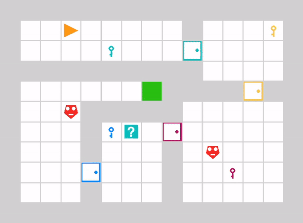

.. curiosity-gym documentation master file, created by
   sphinx-quickstart on Fri Aug 16 13:08:41 2024.
   You can adapt this file completely to your liking, but it should at least
   contain the root `toctree` directive.

###########################
Curiosity Gym documentation
###########################
 
 :Version: 1.0
 
 :Useful links: `Installation <gettingstarted.html#installation>`_ | `Source Repository <https://github.com/chrisreimann/curiosity-gym>`_

Curiosity Gym is a unified Python framework designed to develop, evaluate, and compare curiosity-driven reinforcement learning algorithms. The framework provides three predefined Gymnasium environments, each of which has been designed to address a specific goal of curiosity-driven approaches. In addition to its focus on the distinctive characteristics of curiosity-driven RL, Curiosity Gym emphasizes usability and flexibility, making it an accessible tool for both researchers and practitioners in the field.

.. toctree::
   :hidden:

   gettingstarted
   userguide
   api