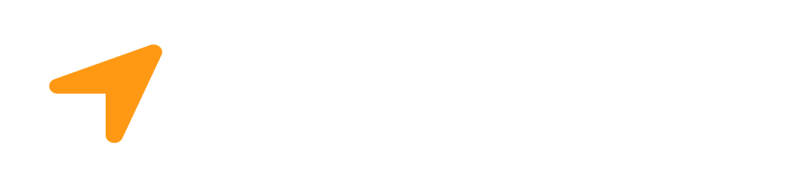
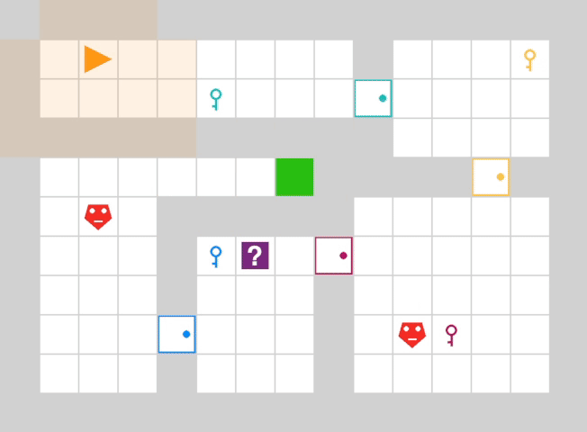

<p align="center">
    
</p>
<p align="center">
    
</p>
Curiosity Gym is a unified Python framework designed to develop, evaluate, and compare curiosity-driven reinforcement learning algorithms. The framework provides three predefined [Gymnasium](https://github.com/Farama-Foundation/Gymnasium) environments, each of which has been designed to address a specific goal of curiosity-driven approaches. In addition to its
focus on the distinctive characteristics of curiosity-driven RL, Curiosity Gym
emphasizes usability and flexibility, making it an accessible tool for both researchers and practitioners in the field. The documentation website can be found [here](https://curiosity-gym.readthedocs.io).


## Installation
Curiosity Gym **requires Python 3.12** or greater.

```
git clone https://github.com/chrisreimann/curiosity-gym
cd curiosity-gym
pip install .
```

## Getting Started
To use the predefined environments from the Curiosity Gym framework, simply import `SparseEnv`, `DistractiveEnv` or `MultitaskEnv` from the package. For Example:

```
# Import predefined environment
from curiosity_gym import SparseEnv

# Initialize environment
env = SparseEnv(agentPOV="local_2", render_mode="human")

# Use Gymnasium API
observation, info = env.reset()
observation, reward, terminated, truncated, info = env.step(action)
env.close()
```
After an environment is initialized, all Gymnasium API methods, like `step`, `reset` or `close` can be used.